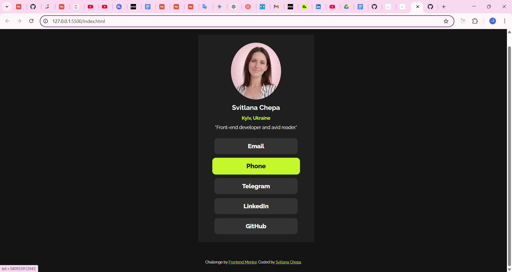

# Frontend Mentor - Social links profile solution

This is my solution to the [Social links profile challenge on Frontend Mentor](https://www.frontendmentor.io/challenges/social-links-profile-UG32l9m6dQ). The goal of this challenge is to practice building a realistic layout using semantic HTML and responsive CSS.

## Table of contents

- [Overview](#overview)
  - [The challenge](#the-challenge)
  - [Screenshot](#screenshot)
  - [Links](#links)
- [My process](#my-process)
  - [Built with](#built-with)
  - [What I learned](#what-i-learned)
  - [Continued development](#continued-development)
- [Author](#author)

## Overview

### The challenge

Users should be able to:

- See hover and focus states for all interactive elements on the page.

- View a responsive profile page with links and an avatar.

### Screenshot



### Links

- Solution URL: [GitHub](https://github.com/Vall-Re/frontend_developer-social-links-rofile)
- Live Site URL: [Demo](https://vall-re.github.io/frontend_developer-social-links-rofile/)

## My process

### Built with

- Semantic HTML5 markup
- CSS custom properties
- Flexbox
- GitHub Pages for hosting

### What I learned

- How to center text and buttons using Flexbox

- Using object-fit: cover for oval avatars

- How to create hover and focus styles for <a> links to improve accessibility

```css
.network {
  display: flex;
  justify-content: center;
  align-items: center;
  width: 250px;
  height: 48px;
  font-size: 18px;
  color: hsl(0, 0%, 100%);
  background-color: hsl(0, 0%, 20%);
  text-decoration: none;
  border-radius: 10px;
  font-weight: 800;
  transition: all 0.5s ease;
}

.network:hover {
  background-color: hsl(75, 94%, 57%);
  color: hsl(0, 0%, 8%);
  transform: scale(1.05);
}

.network:focus-visible {
  outline: 3px solid hsl(75, 94%, 57%);
  outline-offset: 2px;
  background-color: hsl(75, 94%, 57%);
  color: hsl(0, 0%, 8%);
}
```

### Continued development

- Practice using gradient borders and shadows for buttons

- Improve responsiveness for different screen sizes

- Write cleaner, more maintainable CSS for components

## Author

- Website - [GitHub](https://github.com/Vall-Re)
- Frontend Mentor - [@yourusername](https://www.frontendmentor.io/profile/Vall-Re)
